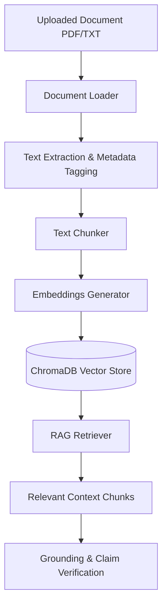
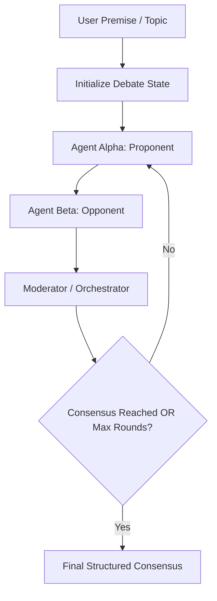

# System Architecture Documentation

This document outlines the conceptual architecture, data flows, and design principles for the **Multi-Agent Argumentative Debate & Decision Engine**.

---

## 1. System Overview

The engine combines two decoupled subsystems:
1. **Document Grounding (RAG Layer)**: Parses, chunks, embeds, indexes, and verifies document-backed evidence.
2. **Adversarial Debate Engine**: Manages multi-agent turn taking, thesis defense, counter-argumentation, and impartial moderation.

---

## 2. Document Grounding (RAG Pipeline)

The RAG pipeline is designed to be completely independent from the debate agent logic. This separation allows RAG logic to be developed, benchmarked, and tested in isolation.

### Conceptual Flow



### Metadata Preservation Standard

To ensure that the Moderator can audit claims and trace evidence back to primary sources, every chunk indexed in ChromaDB must preserve metadata:

| Metadata Field | Type | Description |
| :--- | :--- | :--- |
| `source_file` | `str` | Original filename (e.g., `policy_doc.pdf`) |
| `page_number` | `int` | 1-based page index where chunk originated |
| `chunk_id` | `str` | Unique ID formatted as `doc_name#page_x#chunk_y` |
| `chunk_index` | `int` | Sequential position within parent document |
| `character_count` | `int` | Length of extracted text chunk |

---

## 3. Debate Architecture & Multi-Agent Workflow

The debate subsystem orchestrates turn-taking between three specialized agent roles using a shared state object (`DebateState`).

### Conceptual Flow



### Agent Responsibilities

1. **Proponent (Agent Alpha)**
   - Builds and defends the thesis statement.
   - Leverages evidence retrieved from RAG knowledge base.
   - Responds constructively to Opponent counter-arguments.

2. **Opponent (Agent Beta)**
   - Aggressively audits Alpha's assertions.
   - Searches for unsupported leaps, logical fallacies, internal contradictions, and risk points.
   - Employs RAG evidence to construct grounded counter-evidence.

3. **Moderator / Orchestrator**
   - Serves as impartial judge and turn controller.
   - Evaluates validity of arguments per round.
   - Verifies claim citations against retrieved document evidence.
   - Uses Pydantic structured output to produce JSON reports.

---

## 4. Structured Output Specification (Pydantic Schemas)

The Moderator utilizes Pydantic models to output structured analysis. Key schemas include:

### Claim Verification Schema
```python
class EvidenceCitation(BaseModel):
    source_file: str
    page_number: Optional[int]
    chunk_id: str
    text_snippet: str

class EvaluatedClaim(BaseModel):
    claim_text: str
    status: Literal["supported", "unsupported", "partially_supported"]
    evidence_citations: List[EvidenceCitation]
    fallacy_detected: Optional[str] # e.g. Strawman, Ad Hominem, Circular Reasoning
    confidence_score: float         # 0.0 to 1.0
    logical_rigor_score: float      # 0.0 to 1.0
    reasoning: str
```

### Round Consensus Schema
```python
class RoundEvaluation(BaseModel):
    round_number: int
    proponent_strength: float
    opponent_strength: float
    evaluated_claims: List[EvaluatedClaim]
    unresolved_disagreements: List[str]
    is_consensus_reached: bool
    consensus_summary: Optional[str]
```
---

## 5. Phased Module Boundaries

- `src/rag/`: Handles PDF loading, chunking, embeddings, ChromaDB, vector retrieval, claim grounding.
- `src/agents/`: Encapsulates prompt templates and LLM invocation for Alpha, Beta, and Moderator.
- `src/debate/`: Controls round state updates, turn transitions, and debate termination criteria.
- `app/`: Serves Streamlit interactive web interface.
